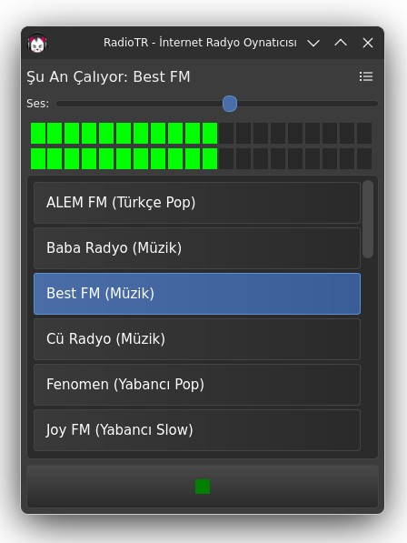

<p dir="auto" align="center">
  
</p>

<div align="center">

**[English](README.md)**

</div>

# RadioTR Player

RadioTR Player, internet radyolarını dinleyebileceğiniz, istasyon ekleyip düzenleyebileceğiniz, ses seviyesini kontrol edebileceğiniz ve gerçek zamanlı VU metre ile takip edebileceğiniz modern bir masaüstü uygulamasıdır.

## Özellikler

- Radyo istasyonu ekleme, düzenleme ve silme
- SQLite veritabanında istasyon saklama
- VLC tabanlı radyo yayını oynatma
- **Gerçek zamanlı VU metre** (gerçek ses seviyesi, PulseAudio monitor kaynağından okunur)
- VU metre için **otomatik cihaz seçimi** (varsayılan hoparlörü dinler; bluetooth bağlanınca/kopunca kendiliğinden geçer)
- **Ses seviyesi kaydırıcısı** (değer hatırlanır)
- **Sistem tepsisi desteği** — tepsi menüsünden istasyon seçme/değiştirme, pencereyi gizleme
- **Çok dilli arayüz** (Türkçe / İngilizce) — Ayarlar → Dil; otomatik sistem dili algılama, seçim hatırlanır
- Oynat/Durdur için tek buton ve ikon desteği
- Modern ve sade koyu tema (PyQt6 + QSS)
- Kanal listesinde fareyle üzerine gelince bilgi gösteren tooltip

## Kurulum

### Gereksinimler

- Python 3.9+
- [VLC](https://www.videolan.org/vlc/) (sistemde kurulu olmalı)
- PulseAudio (`pactl`/`parecord`) — VU metre için (çoğu Linux dağıtımında varsayılan)
- Gerekli Python paketleri:
  - PyQt6
  - python-vlc
  - numpy
  - PyAudio (isteğe bağlı — yalnızca `parecord` bulunmayan sistemlerde VU metre geri düşüşü için)

### Bağımlılıkların kurulumu

Önce sistem paketlerini yükleyin (Linux için):
```bash
vlc
pulseaudio-utils   # pactl + parecord (VU metre)
```

Sonra uygulamayı kurun (bağımlılıkları otomatik yükler):
```bash
pip install .
```

Geliştirme için sanal ortamda düzenlenebilir kurulum:
```bash
python3 -m venv .venv && . .venv/bin/activate
pip install -e .
```

Kurulduktan sonra uygulama `radiotr` komutuyla başlar. İlk açılışta
`~/.local/share/applications/radiotr.desktop` ve uygulama ikonu otomatik
oluşturulur; radyo menüsünden başlatabilirsiniz. Veritabanı
`~/.local/share/RadioTR/playlist.db` altında tutulur (eski komut dizinindeki
`playlist.db` ilk açılışta otomatik taşınır).

### İkonlar

`radiotr/icons/` klasöründe şu dosyalar bulunmalıdır:
- `radio-icon.png` — pencere ve tepsi ikonu
- `play-green.png` / `stop-green.png` — oynat/durdur butonları

Kendi ikonlarınızı da kullanabilirsiniz.

## Kullanım

```bash
radiotr                 # kurulduktan sonra
# veya kaynak koddan:
./player-v3.py
```

- Yeni istasyon eklemek için sağ üstteki ayarlar çarkından "Yeni İstasyon Ekle"yi kullanın.
- Listeden bir istasyon seçip oynatmak için çift tıklayın veya oynat/durdur butonunu kullanın.
- İstasyon üzerinde sağ tıklayarak düzenleyebilir veya silebilirsiniz.
- Ses seviyesini kaydırıcı ile ayarlayın; değer otomatik hatırlanır.
- VU metre ile ses seviyesini gerçek zamanlı takip edebilirsiniz. Hoparlör değişirse
  (ör. bluetooth) otomatik olarak yeni kaynağa geçer; isterseniz ayarlar menüsünden
  elle kaynak seçebilirsiniz.
- Pencereyi kapatmak yerine simge durumuna küçültmek için tepsi ikonuna tıklayın.
- Tepsi ikonuna **sağ tıklayarak** "İstasyonlar" menüsünden radyo değiştirebilirsiniz.
  Çalan istasyon menüde işaretlenir.
- Arayüz dilini **Ayarlar → Dil** menüsünden değiştirin (Otomatik / Türkçe / İngilizce).
  "Otomatik" sistem dilini kullanır; seçim hatırlanır ve açılışta geri yüklenir.

## Veritabanı

İstasyonlar `playlist.db` dosyasında (`~/.local/share/RadioTR/` altında) saklanır.
Veritabanı ilk çalıştırmada otomatik olarak oluşturulur; eski sürümlerden gelen
ayarlar tablosu da otomatik olarak yeni şemaya taşınır.

## Değişiklik Günlüğü

Sürüm notları için [CHANGELOG.md](CHANGELOG.md) dosyasına bakın.

## Katkı ve Lisans

Bu proje GNU General Public License v3.0 lisansı ile yayınlanmıştır.
Katkıda bulunmak için pull request gönderebilirsiniz.
Görüş ve önerilerinizi <a href='https://github.com/erkanisik1/RadioTR/issues' target='_blank'><b>issues</b></a> açarak iletebilirsiniz.

---

**Geliştirici:** Erkan Işık
GitHub: [github.com/erkanisik1](https://github.com/erkanisik1)
